# Top-1M-jarm-V2
This repo is used to compute the jarm values of top 1 millions website.  
This is another iteration on https://github.com/Hugo-C/top-1M-jarm, with a switch from Alexa list to [Tranco](https://tranco-list.eu/).  
[More info on jarm](https://engineering.salesforce.com/easily-identify-malicious-servers-on-the-internet-with-jarm-e095edac525a/).


## Output file template
| tranco rank | domain      | JARM hash                                                      |
|-------------|-------------|----------------------------------------------------------------|
| 1           | google.com  | 29d3fd00029d29d21c42d43d00041df48f145f65c66577d0b01ecea881c1ba |
| 2           | youtube.com | 29d3fd00029d29d21c42d43d00041df48f145f65c66577d0b01ecea881c1ba |


## Architecture

```mermaid
flowchart LR
   Scheduler["Scheduler 🦀"] -- fetch csv --> Tranco["Tranco Website"] 
   Scheduler["Scheduler 🦀"] -- fill the _queue with domains to process --> tasks["/jarm tasks | Redis List/"]
   tasks --> Worker1["Worker performing the JARM scan 🦀"] 
   tasks --> Worker2["Worker performing the JARM scan 🦀"] 
   tasks --> Worker3["Worker performing the JARM scan 🦀"] 
   Worker1 --> scanResultQueue["/_queue of JARM result/"]
   Worker2 --> scanResultQueue
   Worker3 --> scanResultQueue
   scanResultQueue--> Uploader["Uploader aggregates the result in a single CSV and upload it to S3 🦀"]
   Uploader -- Monitor to know when all tasks are acknowledged --> tasks
```

All 🦀 are rust process that are separated from one another and simply launched with the following orders:


## Running
This project use docker swarm (might require `docker swarm init`). Docker rootless doesn't appear to support swarm.
```shell
docker stack deploy --compose-file docker-compose.yml top
docker stack ls
docker service ls
docker service logs top_scheduler -f
docker service logs top_uploader -f
```

Scale workers with:
```shell
docker service scale top_worker=X
```

To remove the running containers:
```shell
docker stack rm top
docker stack ls
```

## Push to docker hub
```shell
docker build -t hugocker/top-1m-jarm-v2 --pull --no-cache .
docker push hugocker/top-1m-jarm-v2
```

